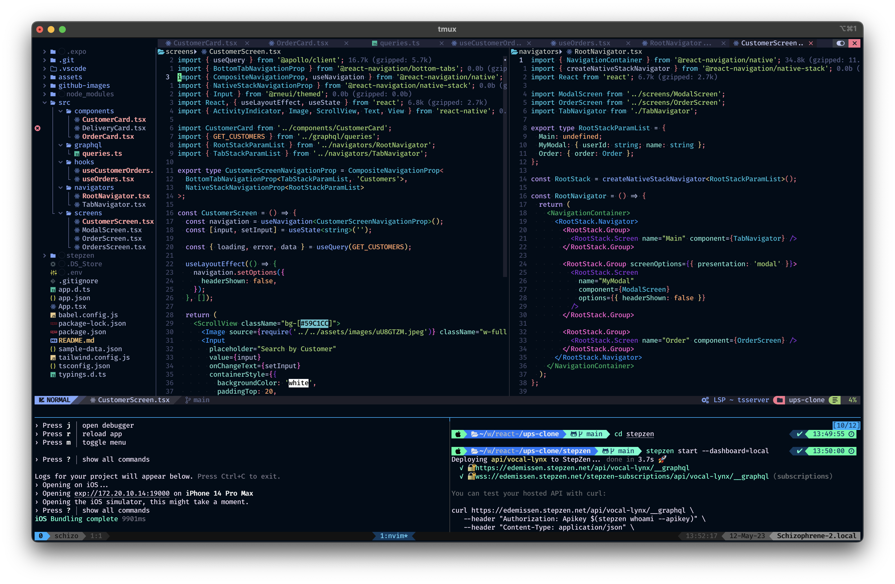

<h1 align="center">My Dotfiles 🎉  </h1>



### Install iTerm2

To install, run:

```bash
brew install --cask iterm2
```

### Install Oh My Zsh

Run this to install Oh My Zsh:

```bash
sh -c "$(curl -fsSL https://raw.githubusercontent.com/ohmyzsh/ohmyzsh/master/tools/install.sh)"
```

### Install PowerLevel10K Theme for Oh My Zsh

Run this to install PowerLevel10K:

```bash
git clone https://github.com/romkatv/powerlevel10k.git $ZSH_CUSTOM/themes/powerlevel10k
```

Now that it's installed, open the "~/.zshrc" file with your preferred editor and change the value of "ZSH_THEME" as shown below:

```bash
ZSH_THEME="powerlevel10k/powerlevel10k"
```

To reflect this change on your terminal, restart it or run this command:

```bash
source ~/.zshrcrew install --cask iterm2
```

### Install `Meslo Nerd Font`

Install the font by pressing "y" and then quit iTerm2.

### Update VSCode Terminal Font (Optional)

Open settings.json and add this line:

```JSON
"terminal.integrated.fontFamily": "MesloLGS NF"
```

### Configure PowerLevel10K

Restart iTerm2. You should now be seeing the PowerLevel10K configuration process. If you don't, run the following:

```bash
p10k configure
```

Follow the instructions for the PowerLevel10K configuration to make your terminal look as desired.

### Change iTerm2 Colors to My Custom Theme

Open iTerm2
Download color profile by running the following command (will be added to Downloads folder):

```bash
curl https://raw.githubusercontent.com/ng-ha/dotfiles/main/coolnight.itermcolors --output ~/Downloads/coolnight.itermcolors
```

- Open iTerm2 preferences
- Go to Profiles > Colors
- Import the downloaded color profile (coolnight)
- Select the color profile (coolnight)
- You can find other themes here: [Iterm2 Color Schemes](https://iterm2colorschemes.com/)

### Install ZSH Plugins

Install zsh-autosuggestions:

```bash
git clone https://github.com/zsh-users/zsh-autosuggestions ${ZSH_CUSTOM:-~/.oh-my-zsh/custom}/plugins/zsh-autosuggestions
```

Install zsh-syntax-highlighting:

```bash
git clone https://github.com/zsh-users/zsh-syntax-highlighting.git ${ZSH_CUSTOM:-~/.oh-my-zsh/custom}/plugins/zsh-syntax-highlighting
```

Open the "~/.zshrc" file in your desired editor and modify the plugins line to what you see below.

```bash
plugins=(git zsh-autosuggestions zsh-syntax-highlighting web-search)
```

Load these new plugins by running:

```bash
source ~/.zshrc
```

Install TMUX with Homebrew
brew install tmux
Create ~/.tmux.conf file
touch ~/.tmux.conf

Install tpm (tmux plugin manager)
Run the following:
git clone https://github.com/tmux-plugins/tpm ~/.tmux/plugins/tpm
